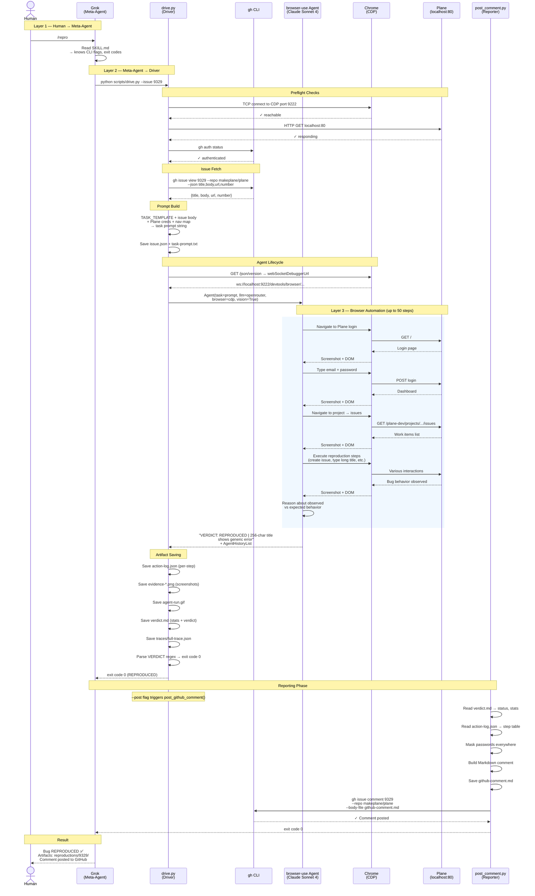

# Architecture — Bug Reproduction Agent

> **Hackathon:** Browser-Use Hackathon, July 4 2026, Bengaluru
> **Target app:** [Plane](https://github.com/makeplane/plane) — open-source project management
> **One-liner:** Given a GitHub issue URL, autonomously reproduces the bug in a running local Plane instance using browser-use (Python), and emits evidence artifacts + a structured verdict.

---

## Design Principles

1. **The issue IS the plan.** Fetch the issue body, inject it into a generic prompt, let the LLM figure out the steps. No hardcoded reproduction logic.
2. **Structured verdict, not keyword matching.** Agent ends with `VERDICT: REPRODUCED | <summary>`. Parsed by one regex. No per-issue matchers.
3. **One script does everything.** `drive.py` fetches, prompts, runs, parses, saves. No multi-phase pipeline.

---

## Identity — Reproducer, NOT Fixer

This agent **reproduces** bugs. It does not fix, patch, or resolve them.

| Verdict | Meaning |
|---------|---------|
| **REPRODUCED** | The reported bug behavior was observed |
| **NOT REPRODUCED** | The reported bug behavior was NOT observed — feature worked correctly |
| **INCONCLUSIVE** | Evidence was ambiguous; cannot confirm or deny the bug |

**Never use:** "FIXED", "RESOLVED", "PATCHED", or any language implying the agent repaired anything.

---

## System Layers

```
┌─────────────────────────────────────────────────────────────────┐
│  HUMAN                                                          │
│  "Reproduce issue #9329"                                        │
└──────────────────────────┬──────────────────────────────────────┘
                           │
                           ▼
┌─────────────────────────────────────────────────────────────────┐
│  GROK (Meta-Agent)                                              │
│                                                                 │
│  Reads: .claude/skills/repro-agent/SKILL.md                     │
│  Knows: drive.py CLI flags, exit codes, artifact paths          │
│  Does:  orchestrate scripts, interpret results, retry/chain     │
│                                                                 │
│  Pre:   python scripts/seed.py check   (→ populate if needed)   │
│  Runs:  python scripts/drive.py --issue 9329                    │
│  Then:  reviews artifacts, Playwright test, verdict              │
└──────────────────────────┬──────────────────────────────────────┘
                           │ subprocess
                           ▼
┌─────────────────────────────────────────────────────────────────┐
│  drive.py (Driver Script)                                       │
│                                                                 │
│  1. Auto-discover Chrome CDP (port 9222)                        │
│  2. Preflight: Chrome ✓  Plane ✓  gh ✓                          │
│  3. gh issue view → fetch title + body                          │
│  4. Template + issue body + creds → task prompt                 │
│  5. Create browser-use Agent(task, llm, browser)                │
│  6. agent.run(max_steps=50) with timeout                        │
│  7. Save artifacts to reproductions/<N>/                        │
│  8. Parse VERDICT line → exit code                              │
└──────────────────────────┬──────────────────────────────────────┘
                           │ in-process
                           ▼
┌─────────────────────────────────────────────────────────────────┐
│  browser-use Agent (Claude Sonnet 4 via OpenRouter)             │
│                                                                 │
│  Receives: natural language task with bug report + Plane creds  │
│  Does:     login → navigate → execute repro steps → observe     │
│  Emits:    VERDICT: REPRODUCED | <summary>                     │
│                                                                 │
│  This is the ONLY layer that reasons about the bug.             │
└──────────────────────────┬──────────────────────────────────────┘
                           │ CDP WebSocket
                           ▼
┌─────────────────────────────────────────────────────────────────┐
│  Chrome → Plane (localhost:80)                                │
│  Docker: Next.js + Django + Postgres + Redis + MinIO            │
└─────────────────────────────────────────────────────────────────┘
```

---

## UML Sequence Diagram



---

## Layer Ownership

| Concern | Grok | seed.py | drive.py | browser-use Agent | post_comment.py |
|---------|:-----:|:-------:|:--------:|:-----------------:|:---------------:|
| User interface | ✅ | | | | |
| Skill knowledge | ✅ | | | | |
| Script orchestration | ✅ | | | | |
| Exit code interpretation | ✅ | | | | |
| Retry decisions | ✅ | | | | |
| Env readiness check | | ✅ | | | |
| Seed data population | | ✅ | | | |
| Plane API auth (session) | | ✅ | | | |
| CDP auto-discovery | | | ✅ | | |
| Preflight checks | | | ✅ | | |
| Issue fetching (gh) | | | ✅ | | |
| Prompt engineering | | | ✅ | | |
| Agent lifecycle | | | ✅ | | |
| Artifact saving | | | ✅ | | |
| Verdict parsing | | | ✅ | | |
| Crash recovery | | | ✅ | | |
| Bug reasoning | | | | ✅ | |
| Browser navigation | | | | ✅ | |
| Screenshot capture | | | | ✅ | |
| Verdict emission | | | | ✅ | |
| Artifact reading | | | | | ✅ |
| Comment generation | | | | | ✅ |
| Password masking | | | | | ✅ |
| GitHub posting | | | | | ✅ |

---

## Exit Conditions

| Condition | What happens |
|-----------|-------------|
| ✅ Agent emits `VERDICT: REPRODUCED` | Artifacts saved, exit code 0 |
| ❌ Agent emits `NOT_REPRODUCED` | Artifacts saved, exit code 1 |
| ⚠️ Agent emits `INCONCLUSIVE` | Artifacts saved, exit code 2 |
| 🚨 Agent crash / Plane crash | Partial artifacts + error.txt saved, exit code 3 |
| ⏰ Timeout (default 300s) | Partial artifacts + error.txt saved, exit code 3 |
| 📊 50 steps exhausted | Agent must conclude with whatever evidence it has |

---

## browser-use Integration

| Property | Value |
|----------|-------|
| Library | `browser-use` (Python, `pip install browser-use`) |
| Model | Claude Sonnet 4 via OpenRouter (`ChatOpenAI` with OpenRouter base_url) |
| Connection | CDP to existing Chrome (auto-discovered from port 9222) |
| Driver | `scripts/drive.py --issue <N>` or `--url <github-url>` |
| Operations | Single `Agent(task=..., llm=...).run()` — agent handles all navigation/actions |
| Built-in | Screenshots, GIF generation, conversation saving, video recording |
| Traces | `history.save_to_file()` → `reproductions/<issue>/traces/full-trace.json` |

---

## Plane Knowledge

Injected into the agent prompt by `drive.py`. All values read from `.env` with defaults in `scripts/drive.py`:

| Knowledge | Source of truth |
|-----------|----------------|
| Base URL | `.env` → `PLANE_URL`; default in `scripts/drive.py` `PLANE_URL` |
| Login | `.env` → `PLANE_EMAIL`, `PLANE_PASSWORD`; defaults in `scripts/drive.py` |
| Workspace | `.env` → `PLANE_WORKSPACE`; default in `scripts/drive.py` `PLANE_WORKSPACE` |
| Project | `scripts/seed.py` → `SEED_PROJECT_NAME`, `SEED_PROJECT_ID` |
| Nav pattern | `scripts/drive.py` → `TASK_TEMPLATE` Principles section |
| Auth flow | Email + password login page |
| Existing data | Defined in `scripts/seed.py` → `SEED_STATES` and `SEED_ISSUES` lists |

---

## Demo Bugs (Hackathon Examples)

Works on any Plane issue. These are good demos — visual and fast:

| # | Bug | Bug Class |
|---|-----|-----------|
| **9329** | 255+ char title shows generic error | form-validation |
| **9050** | Deleted stickies reappear on reload | state-persistence |
| **9124** | Sub-task expand requires 3 clicks | ui-interaction |

---

## File Structure

```
bug-repro-agent/
├── scripts/
│   ├── __init__.py                   ← makes scripts/ importable
│   ├── seed.py                       ← environment readiness checker + seed data populator
│   ├── drive.py                      ← main reproduction agent
│   ├── generate_playwright.py         ← converts action-log.json → Playwright test
│   └── post_comment.py               ← generates + posts GitHub comment
├── .claude/skills/repro-agent/
│   └── SKILL.md                      ← skill definition
├── reproductions/                    ← output directory (populated per-run)
│   └── <issue-number>/
│       ├── issue.json
│       ├── task-prompt.txt
│       ├── action-log.json
│       ├── evidence-*.png
│       ├── agent-run.gif
│       ├── conversation.json
│       ├── verdict.md
│       ├── error.txt                 ← written on crash/timeout
│       ├── test_<N>.py               ← auto-generated Playwright regression test
│       ├── github-comment.md         ← generated by post_comment.py
│       └── traces/full-trace.json
├── .env.example                      ← config template
├── requirements.txt                  ← Python deps
├── pyproject.toml                    ← Python project config
├── ARCHITECTURE.md                   ← this file
├── README.md
└── plane/                            ← Plane clone (gitignored)
```

---

## Demo Structure (Hackathon Stage)

**Three beats, ~4 min total:**

| Beat | Goal | Key moment |
|------|------|-----------|
| **Live reproduction** (~2 min) | Run `drive.py --issue 9329` live | Audience sees browser moving autonomously |
| **Artifact inspection** (~1 min) | Show verdict.md, screenshots, action-log | Evidence the bug was found |
| **GitHub report** (~30s) | `drive.py --post` calls `post_github_comment()` | Agent posts rich report back to the issue |

---

## Terminology

| Term | Definition |
|------|-----------|
| **repro-agent** | The system. |
| **seed.py** | Environment readiness CLI — `check` verifies Plane is ready, `populate` creates seed data. Runs before drive.py. |
| **drive.py** | The main Python script — fetches issue, runs agent, saves artifacts. |
| **post_comment.py** | Reads artifacts, builds Markdown comment, posts to GitHub issue. |
| **browser-use** | Python library — resolves NL task → DOM actions via Playwright. In-process, no server. |
| **Verdict** | `REPRODUCED`, `NOT_REPRODUCED`, or `INCONCLUSIVE`. Structured line parsed from agent output. |
| **Artifact bundle** | All output: `issue.json`, `task-prompt.txt`, `action-log.json`, `evidence-*.png`, `verdict.md`, `agent-run.gif`, `conversation.json`, `traces/`, `error.txt`, `github-comment.md`. |
| **Action log** | `action-log.json` — every agent step (thought, action, result, URL). |
| **Preflight** | Checks run by drive.py before starting the agent: Chrome reachable, Plane frontend+backend healthy, gh authenticated. |
| **Seed data** | SEED project with states and work items defined in `scripts/seed.py` (`SEED_STATES`, `SEED_ISSUES`), created by `seed.py populate`. |
