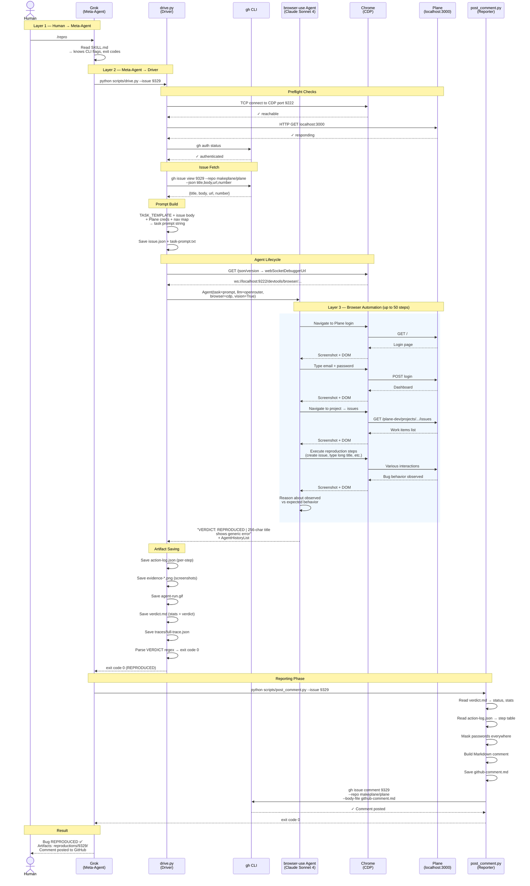

# Architecture — Bug Reproduction Agent

## System Layers

```
┌─────────────────────────────────────────────────────────────────┐
│  HUMAN                                                          │
│  "Reproduce issue #9329"                                        │
└──────────────────────────┬──────────────────────────────────────┘
                           │
                           ▼
┌─────────────────────────────────────────────────────────────────┐
│  GROK (Meta-Agent)                                              │
│                                                                 │
│  Reads: .claude/skills/repro-agent/SKILL.md                     │
│  Knows: drive.py CLI flags, exit codes, artifact paths          │
│  Does:  orchestrate scripts, interpret results, retry/chain     │
│                                                                 │
│  Runs:  python scripts/drive.py --issue 9329                    │
│  Then:  python scripts/post_comment.py --issue 9329             │
└──────────────────────────┬──────────────────────────────────────┘
                           │ subprocess
                           ▼
┌─────────────────────────────────────────────────────────────────┐
│  drive.py (Driver Script)                                       │
│                                                                 │
│  1. Auto-discover Chrome CDP (port 9222)                        │
│  2. Preflight: Chrome ✓  Plane ✓  gh ✓                          │
│  3. gh issue view → fetch title + body                          │
│  4. Template + issue body + creds → task prompt                 │
│  5. Create browser-use Agent(task, llm, browser)                │
│  6. agent.run(max_steps=50) with timeout                        │
│  7. Save artifacts to reproductions/<N>/                        │
│  8. Parse VERDICT line → exit code                              │
└──────────────────────────┬──────────────────────────────────────┘
                           │ in-process
                           ▼
┌─────────────────────────────────────────────────────────────────┐
│  browser-use Agent (Claude Sonnet 4 via OpenRouter)             │
│                                                                 │
│  Receives: natural language task with bug report + Plane creds  │
│  Does:     login → navigate → execute repro steps → observe     │
│  Emits:    VERDICT: REPRODUCED | <summary>                     │
│                                                                 │
│  This is the ONLY layer that reasons about the bug.             │
└──────────────────────────┬──────────────────────────────────────┘
                           │ CDP WebSocket
                           ▼
┌─────────────────────────────────────────────────────────────────┐
│  Chrome → Plane (localhost:3000)                                │
│  Docker: Next.js + Django + Postgres + Redis + MinIO            │
└─────────────────────────────────────────────────────────────────┘
```

---

## UML Sequence Diagram



---

## What Each Layer Owns

| Concern | Grok | drive.py | browser-use Agent | post_comment.py |
|---------|:-----:|:--------:|:-----------------:|:---------------:|
| User interface | ✅ | | | |
| Skill knowledge | ✅ | | | |
| Script orchestration | ✅ | | | |
| Exit code interpretation | ✅ | | | |
| Retry decisions | ✅ | | | |
| CDP auto-discovery | | ✅ | | |
| Preflight checks | | ✅ | | |
| Issue fetching (gh) | | ✅ | | |
| Prompt engineering | | ✅ | | |
| Agent lifecycle | | ✅ | | |
| Artifact saving | | ✅ | | |
| Verdict parsing | | ✅ | | |
| Crash recovery | | ✅ | | |
| Bug reasoning | | | ✅ | |
| Browser navigation | | | ✅ | |
| Screenshot capture | | | ✅ | |
| Verdict emission | | | ✅ | |
| Artifact reading | | | | ✅ |
| Comment generation | | | | ✅ |
| Password masking | | | | ✅ |
| GitHub posting | | | | ✅ |

---

## Key Insight

**Grok never touches the bug.** It's a pure orchestrator:
- Reads SKILL.md to know what's possible
- Translates human intent into script invocations
- Interprets exit codes to understand outcomes
- Chains scripts (drive → post_comment)
- Can adjust parameters (--timeout, --dry-run) based on context

**drive.py never reasons about the bug.** It's infrastructure:
- Fetches the issue, builds the prompt, manages the agent lifecycle
- Saves everything to disk even on crash
- Parses the structured verdict line mechanically

**The browser-use Agent is the only intelligence** that reads the bug report,
figures out what steps to take, drives the browser, observes the behavior,
and decides whether the bug was reproduced.